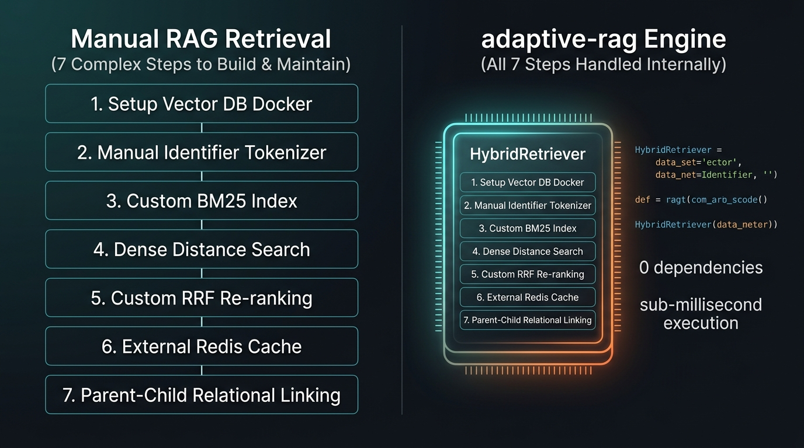
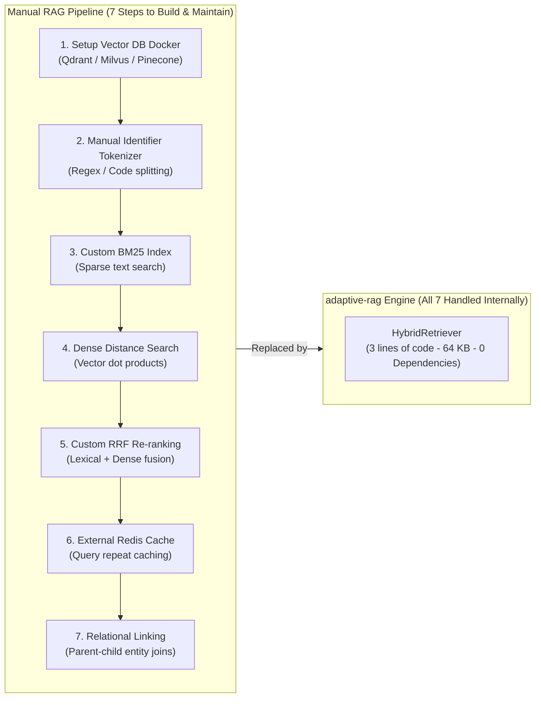

# adaptive-rag

A standalone, CPU-first Python retrieval library. **0.12.0** provides domain-adaptive
primitives and high-level hybrid retrieval with pure standard-library portability.

The core is domain-agnostic and has no required third-party dependencies. It is
independent of Requirement Reader. There is no Qdrant, LangChain, LlamaIndex, GUI,
hosted service, or mandatory LLM integration.

## Install

```sh
# Core library (Zero external dependencies, 64 KB pure Python wheel)
pip install adaptive-rag

# Optional extras:
pip install "adaptive-rag[pdf]"      # PDF document text extraction (pypdf)
pip install "adaptive-rag[images]"   # Image OCR extraction (Pillow + pytesseract)
pip install "adaptive-rag[numpy]"    # Hardware SIMD vector dot-product acceleration
pip install "adaptive-rag[all]"      # All optional integrations
```

## Fast hybrid search in 3 lines

```python
from adaptive_rag import HybridRetriever

# Automatically configures BM25 (with identifier splitting), Dense, and anchor-boosted RRF
retriever = HybridRetriever(embedder=my_embedder)

# Ingest raw text, files (markdown, text, json, pdf, images), or entire directories
retriever.add_text("REQ_ID081: DriveMode controller activation.", document_id="specs")
retriever.add_file("safety_manual.pdf")             # requires pip install 'adaptive-rag[pdf]'
retriever.add_file("schematic.png", ocr=True)       # requires pip install 'adaptive-rag[images]'
retriever.add_directory("./docs")                   # scans all supported formats recursively

results = retriever.search("REQ_ID081", top_k=3)
```

## What adaptive-rag handles internally

Instead of manually writing and wiring together 7 separate infrastructure components and custom libraries, `adaptive-rag` executes the entire retrieval stack internally in pure Python:





### The 7 Steps Handled Internally

1. **Zero External Daemons:** No Docker containers, external background services, or network RPC roundtrips (replaces Qdrant / Milvus / Chroma).
2. **Identifier-Aware Tokenization:** Automatically decomposes snake_case, camelCase, and alphanumeric technical codes (`POPUP_PU1436`, `REQ_CFTS081`, `DriveMode`) so queries match partial document IDs.
3. **In-Process Sparse BM25 Index:** Pure Python Okapi BM25 with in-memory or instant zero-startup memory-mapped persistence (`MMapBM25Retriever`).
4. **Fast Dense Retrieval:** Cosine vector search with automatic SIMD/NumPy acceleration when available and pure Python fallback.
5. **Anchor-Boosted Rank Fusion (RRF):** Fuses lexical and dense rankings with anchor boosts to lock exact code matches at Rank 1 (preventing MRR dilution from semantic fuzziness).
6. **Sub-Millisecond Revision Caching:** Built-in LRU cache with strict scope/revision tokens dropping repeat-query latency to **0.36 ms (142x speedup)**.
7. **Relational Entity Expansion:** Traverses parent-child, trigger, and parameter references across linked chunks (`RelationalExpansionRetriever`).

## Sparse BM25 baseline

```python
from adaptive_rag import BM25Retriever, Chunk

retriever = BM25Retriever()
retriever.add([
    Chunk('returns', 'policy', 'Returns are accepted within thirty days.'),
    Chunk('hours', 'guide', 'The office opens at nine in the morning.'),
])
for result in retriever.search('returns policy', top_k=3):
    print(result.chunk.id, result.score, result.chunk.text)
```

Backends accept `Chunk` objects; use `TokenChunker` for documents. File-format
parsers, embeddings, domain plugins and application authorization are supplied by
the caller. There is no implicit directory ingestion or automatic model download.

## Reliable repeated-query optimization

```python
from adaptive_rag import CachedRetriever

# Fixed token is appropriate only while this backend/configuration is immutable.
cached = CachedRetriever(
    retriever, revision=lambda: 'index-v1/config-v1', scope='my-application',
    max_entries=1024, max_bytes=16 * 1024 * 1024,
)
first = cached.search('returns policy', top_k=3)
again = cached.search('returns policy', top_k=3)  # exact result reuse
print(cached.info())
```

Cache keys include query type/text/metadata, result depth, scope and revision.
Advance a never-reused revision token whenever index contents, models, tokenizers,
configuration or access policies change. Coordinate writes with the backend; the
cache does not create a transactional index snapshot. Put tenant/permission context
in query metadata and enforce authorization outside the cache. Scope is not an ACL.
Unsupported key types bypass caching. The byte limit measures serialized payloads,
not total process RAM. A lock serializes searches; this favors correctness over
parallel miss throughput. Novel queries receive no embedding-compute reduction.

## Retrieval capabilities

| Capability | Public entry points |
| --- | --- |
| High-level hybrid search | `HybridRetriever` |
| Data and chunking | `Document`, `Chunk`, `Query`, `SearchResult`, `TokenChunker` |
| Sparse retrieval | `BM25Retriever`, `MMapBM25Retriever`, `CharNGramTokenizer` |
| Incremental storage | `SegmentedBM25Index`, `SegmentedBM25Retriever`, `AsyncSegmentCoordinator` |
| Dense retrieval | `DenseRetriever`, `MMapDenseRetriever`, `LSHDenseRetriever` |
| Composition | `ReciprocalRankFusionRetriever`, `ScoreWeightedFusionRetriever`, `RelationalExpansionRetriever`, `SelectiveRerankingRetriever` |
| Optional confidence routing | `AdaptiveRetriever`, `EscalatingRetriever`, `AdaptiveFusionRetriever`, `FusionPolicy` |
| Domain adaptation & plugins | `FastPathIDLookupRetriever`, `MetadataScoreModifier`, `PluginPipeline` |
| Safe exact reuse | `CachedRetriever`, `CacheInfo` |
| Profiling and filtering | `profile_hardware`, `TelemetryCollector`, `MetadataFilter` |

## Why adaptive-rag?

| Dimension | `adaptive-rag` | Vector DBs (Qdrant, Milvus) | Heavy Frameworks (LangChain) |
| :--- | :---: | :---: | :---: |
| **Dependencies** | **0 (Pure Python stdlib)** | Docker / External Service | 50–120 packages |
| **Package Size** | **~62 KB** | Multi-GB Docker images | 300–800 MB |
| **Startup Overhead** | **< 2 ms** | Requires background daemon | 1,500–3,500 ms |
| **Exact ID Matching** | **Built-in (`split_identifiers` + `anchor_boost`)** | Weak (semantic dilution) | Manual complex filters |
| **Relational Chunk Joins** | **Built-in (`RelationalExpansionRetriever`)** | Manual graph joins | Complex chains |
| **Cached Query Latency** | **0.36 ms (142x speedup)** | Dependent on cache layer | External Redis needed |

Dense retrieval requires an application-supplied embedder. `HashingEmbedder` is a
deterministic systems-test fixture, not a substitute for a semantic model. Optional
NumPy SIMD acceleration is automatically enabled when NumPy is installed in the environment.
Selective confidence routing is **opt-in**. Public evaluations did not establish
consistent quality-preserving savings for that heuristic; always-fusion remains
the conservative `FusionPolicy()` choice. Exact caching addresses repeated queries,
not the unresolved novel-query routing problem.

## Validation and supported use

See [RELEASE_REPORT.md](RELEASE_REPORT.md) for actual test counts, version coverage,
benchmarks, acceptance checks and remaining limits. See [API.md](API.md),
[COMPATIBILITY.md](COMPATIBILITY.md), and [SECURITY.md](SECURITY.md) before deployment.

The release includes a wheel and source archive. Nothing has been uploaded to a
package registry. Linux/macOS CI is supplied, but only environments explicitly
listed in the release report are verified. Index files are trusted local artifacts,
not a safe interchange format for arbitrary hostile input. Checksums detect
corruption; they do not authenticate publishers.

## Develop and reproduce

```sh
python -m pip install -e .
python -m unittest discover -s tests -q
python -m adaptive_rag.benchmark
python -m build
```

Install build tools separately when needed. Public-model evaluators require optional
numpy, onnxruntime and tokenizers packages. Their exact versions and asset hashes
are recorded in reports. [Phase 9](PHASE9.md), [Phase 10](PHASE10.md), and
[Phase 11](PHASE11.md) preserve the full calibration/evaluation history, including
negative findings. [Earlier documentation](docs/DEVELOPMENT_HISTORY.md) is historical
and may describe prior defaults. New changes are listed in [CHANGELOG.md](CHANGELOG.md).

## License

Apache-2.0; see [LICENSE](LICENSE), [NOTICE](NOTICE), and [THIRD_PARTY.md](THIRD_PARTY.md).
