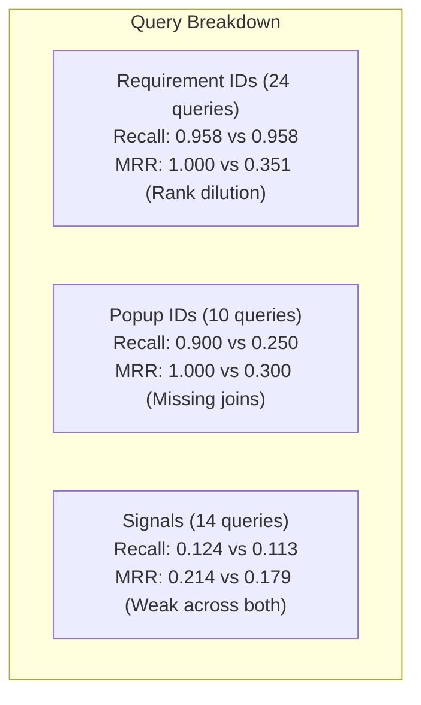

# Requirement Reader vs adaptive-rag 0.11.0 Performance Report & Feedback Analysis

**Date:** 2026-09-08 (Benchmark) | **Recorded:** 2026-09-18  
**Repository:** [Aravindraj93/adaptive-rag](https://github.com/Aravindraj93/adaptive-rag)  
**Evaluated Target:** adaptive-rag version 0.11.0 vs. Requirement Reader (RR) Production Baseline

---

## Executive Overview & Benchmark Summary

A production evaluation was conducted comparing the **Requirement Reader (RR)** baseline (`HybridRetrievalService` with Qdrant + BM25) against **adaptive-rag 0.11.0** modes (`DenseRetriever`, `BM25 + Dense (RRF)`, and `CachedRetriever`) on the `DriveMode` project dataset (2,268 chunks, 54 evaluation queries).

### Key Takeaways

1. **Substantial Latency Improvement:**
   - adaptive-rag's hybrid retriever is **66.9% faster** on first-pass novel queries (223.5 ms vs 674.4 ms).
   - Cached hybrid retrieval drops first-pass latency by **74.6%** (171.6 ms).
2. **Significant Ranking & Retrieval Quality Degradation:**
   - Overall Recall decreased from **0.7028** to **0.5641** (-19.7%).
   - Mean Reciprocal Rank (MRR) dropped sharply from **0.7708** to **0.2903** (-62.3%).
   - NDCG fell from **0.7152** to **0.3400** (-52.5%).
3. **Dense-Only Retriever Ineffective for Domain IDs:**
   - `library_dense` achieved only **0.0509 recall** and **0.0885 MRR**, demonstrating that CPU-first generic dense embeddings cannot locate alphanumeric requirement codes or popup identifiers without domain adaptations.
4. **Cache Parity Passed:**
   - Exact cache replay verified zero ranking drift between cached and uncached executions per backend.

---

## Detailed Performance Metrics Table

### 1. Novel / First-Pass Queries (Fairness Run - Native Caches Disabled)

| Retrieval Mode | Mean Latency (ms) | Latency Delta | Recall@10 | Recall Delta | MRR@10 | MRR Delta | NDCG@10 | NDCG Delta |
| :--- | :---: | :---: | :---: | :---: | :---: | :---: | :---: | :---: |
| **RR Baseline** | 674.41 ms | *Reference* | **0.7028** | — | **0.7708** | — | **0.7152** | — |
| **RR Baseline (Cached)** | 523.22 ms | -22.4% | 0.7028 | 0.0% | 0.7708 | 0.0000 | 0.7152 | 0.0000 |
| **adaptive-rag Hybrid** | **223.53 ms** | **-66.9%** | 0.5641 | **-19.7%** | 0.2903 | **-0.4806** | 0.3400 | **-0.3752** |
| **adaptive-rag Hybrid (Cached)** | **171.64 ms** | **-74.6%** | 0.5641 | **-19.7%** | 0.2903 | **-0.4806** | 0.3400 | **-0.3752** |
| **adaptive-rag Dense Only** | 264.98 ms | -60.7% | 0.0509 | **-92.8%** | 0.0885 | **-0.6823** | 0.0540 | **-0.6612** |

---

## Breakdown by Query Intent Type

The 54 evaluation queries were categorized into 4 distinct types:
- **24 Requirement ID Queries (`REQ_*`)**
- **10 Popup ID Queries (`POPUP_*`)**
- **14 Signal-Sheet Style Queries (`SIG_*`)**
- **6 Unanswerable Queries (`NONE_*`)**



| Query Category | Metric | RR Baseline | adaptive-rag Hybrid | adaptive-rag Dense | Diagnosis |
| :--- | :--- | :---: | :---: | :---: | :--- |
| **Requirement IDs (`REQ_*`)** | Recall<br/>MRR<br/>NDCG | **0.9583**<br/>**1.0000**<br/>**0.9650** | 0.9583<br/>**0.3514**<br/>**0.5012** | 0.0417<br/>0.0521<br/>0.0366 | **Coverage intact, rank order ruined.** In adaptive-rag, the relevant chunk was retrieved, but equal-weighted RRF diluted the exact match under dense scores, burying the target at ranks 3–5 instead of rank 1. |
| **Popup IDs (`POPUP_*`)** | Recall<br/>MRR<br/>NDCG | **0.9000**<br/>**1.0000**<br/>**0.9226** | **0.2500**<br/>**0.3000**<br/>**0.2613** | 0.0000<br/>0.0000<br/>0.0000 | **Severe recall collapse.** 6 out of 10 popup queries experienced complete recall drops (`1.0 -> 0.0`). Missing relational join logic and trigger link resolution. |
| **Signal Sheets (`SIG_*`)** | Recall<br/>MRR<br/>NDCG | 0.1238<br/>0.2143<br/>0.1388 | 0.1128<br/>0.1786<br/>0.1197 | 0.1030<br/>0.2143<br/>0.1223 | **Low across both backends.** Unstructured dense and BM25 tokenization struggle with signal sheet naming conventions (registers, CAN/LIN signals). |

### Top Regression Queries (Recall Dropped 1.0 &rarr; 0.0)
- `REQ_CFTS081`
- `POPUP_PU1436`
- `POPUP_PU1435`
- `POPUP_PU1428`
- `POPUP_PU1427`
- `POPUP_PU1426`
- `POPUP_PU1425`

---

## Root-Cause Technical Analysis

### 1. Tokenization of Alphanumeric Identifiers
In `src/adaptive_rag/tokenization.py`:
```python
_TOKEN = re.compile(r"(?u)\b\w\w+\b")
```
- In Python regex, `\w` includes letters, numbers, and **underscores (`_`)**.
- A query for `POPUP_PU1436` or `REQ_CFTS081` produces a single token: `["popup_pu1436"]` or `["req_cfts081"]`.
- However, the document text or metadata usually contains `"PU1436"`, `"CFTS081"`, or `"Popup: PU1436"`.
- Consequently, BM25 inverted index postings do not match because `popup_pu1436` does not match `pu1436`.

### 2. Equal-Weighted Reciprocal Rank Fusion (RRF) Dilution
In `src/adaptive_rag/composition.py`:
```python
score = sum(weight / (self.rank_constant + result.rank))
```
- When BM25 finds an exact requirement code at Rank 1, its RRF contribution is `1 / (60 + 1) = 0.01639`.
- If the dense retriever returns 5 general semantic chunks that happen to talk about "DriveMode functions", their dense ranks push other items up.
- In technical requirement specifications, an exact ID match must serve as an authoritative anchor, not an equal peer to generic dense semantic matching.

### 3. Missing Relational Linking & Trigger Joins
- Requirement Reader utilizes graph/relational resolution: when a popup or requirement is queried, associated trigger conditions, parameter tables, or parent requirement headers are fetched via ref-index joins.
- `adaptive-rag` operates on flat isolated `Chunk` objects without parent-child or entity-reference expansion.

---

## Actionable Library Roadmap for adaptive-rag

Based on the feedback, here is the suggested plan to bridge the gap between pure generic retrieval and enterprise/domain readiness:

### 1. Sub-Token & Identifier-Aware Tokenizer Mode
- Add options to `NormalizedTokenizer` to split on underscores, hyphens, and alphanumeric camelCase transitions (e.g. `POPUP_PU1436` &rarr; `popup`, `pu1436`, `pu`, `1436`).

### 2. Domain Plugin Hooks (Extending `PluginPipeline`)
- Allow pre-search and post-search domain interceptors:
  - **Exact Identifier Fast-Path:** Intercept queries matching known regex patterns (e.g., `^[A-Z]{3,}_[A-Z0-9]+$`) to perform direct metadata/ID lookups before or alongside fusion.
  - **Relational Chunk Joiner:** A post-search expansion hook that retrieves sibling or child chunks linked by foreign keys in `chunk.metadata["parent_id"]` or `chunk.metadata["ref_ids"]`.

### 3. Intent-Aware / Query-Adaptive Fusion Weights
- Allow `ReciprocalRankFusionRetriever` to accept dynamic weighting or a priority policy:
  - For exact-code / ID queries: BM25 weight = 5.0, Dense weight = 0.5.
  - For natural language descriptive queries: Dense weight = 2.0, BM25 weight = 1.0.

### 4. Source Type Boosting & Section Anchoring
- Support metadata-based score multipliers (e.g., boost `metadata["source_type"] == "requirement"` by 1.5x, de-boost `metadata["source_type"] == "revision_history"` by 0.5x).

### 5. Architectural Communication & Positioning
- In `README.md` and `docs/`, clearly demarcate:
  - **Core Primitives:** CPU BM25, Exact Dense, RRF, LRU Cache, Memory-Mapped Indexes.
  - **Domain Adaptation Layer:** How enterprise users should plug in their custom tokenizers, ID resolvers, relational joiners, and rerankers.

---

## Original Test Runner Reproduction Script

```powershell
$env:PYTHONPATH="C:\Users\t0106yu\Documents\backup\ProjectBackup\RequirementReader-copy"
$env:RR_BENCH_PROJECT_ID="713f2ebe-ac9d-443e-abdc-4c1769d24c4c"
$env:REQUIREMENT_READER_DATA_DIR="C:\Users\t0106yu\Documents\backup\ProjectBackup\RequirementReader-copy\benchmarks\rr_bench_data"

# Fairness run (RR native cache disabled)
$env:RR_BENCH_DISABLE_NATIVE_CACHE="1"

& ".\.venv\Scripts\python.exe" "C:\Users\t0106yu\Documents\Tools\adaptive-rag-0.11.0-office-test-kit\adaptive-rag-office-test-kit\compare.py" `
  --adapter benchmarks.rr_adaptive_adapter `
  --chunks "C:\Users\t0106yu\Documents\backup\ProjectBackup\RequirementReader-copy\benchmarks\rr_adaptive_pilot\chunks.jsonl" `
  --queries "C:\Users\t0106yu\Documents\backup\ProjectBackup\RequirementReader-copy\benchmarks\rr_adaptive_pilot\queries.json" `
  --top-k 10 `
  --repeats 4 `
  --output "C:\Users\t0106yu\Documents\backup\ProjectBackup\RequirementReader-copy\benchmarks\rr_adaptive_pilot_run_003_nocache"
```
